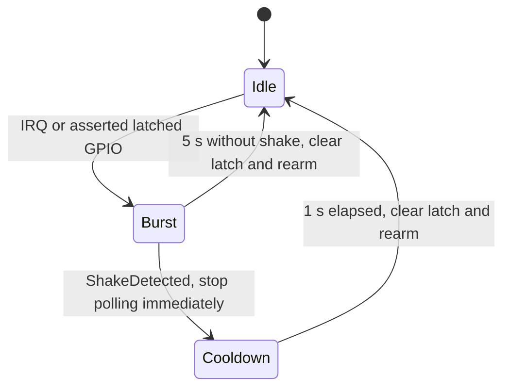

# Accelerometer Service

`AccelService` owns accelerometer access on a dedicated RTOS worker. While Go
is awake, a motion interrupt starts a short capture that classifies side-to-side
shakes and posts `ShakeDetected`. The orchestrator decides whether to accept
the gesture, beep, and refresh measurements. Accelerometer wake from deep sleep
is not implemented.

## Files

| File | Purpose |
|---|---|
| `main/accel/accel_sensor.h` | Hardware-neutral configuration and reading interface |
| `main/accel/lis2dh12.h` / `lis2dh12.cpp` | LIS2DH12 register configuration, reads, and interrupt clearing |
| `main/accel/shake_detector.h` / `shake_detector.cpp` | Sample-based gesture classification and cooldown timing |
| `main/accel/accel_service.h` / `accel_service.cpp` | Worker, interrupt capture, and Hardware Test commands |
| `main/go_app.cpp` | Sensor creation and service startup |

Paths above are relative to `products/go/`.

## Dependencies

| Dependency | Source | Usage |
|---|---|---|
| `AccelSensor` | `accel/accel_sensor.h` | Configure and read the sensor; driver has no refresh policy |
| `ShakeDetector` | `accel/shake_detector.h` | Classify filtered XYZ samples |
| `gpio::Hal` | `airgradient-common` | Register, mask, rearm, and read the interrupt GPIO |
| RTOS | `airgradient-common` | Worker, queues, timing, and shutdown synchronization |
| `Event` | `go_events.h` | Deliver timestamped `ShakeDetected` to the orchestrator |

## Public API

| Method | Returns | Purpose |
|---|---|---|
| `start()` | `bool` | Create the worker; sensor configuration runs in that worker |
| `stop()` | `void` | Join the worker, detach the interrupt, and power down the sensor |
| `begin_hardware_test(out)` | `bool` | Switch to unfiltered ±4 g readings and return the first reading |
| `read_hardware_test(out)` | `bool` | Read XYZ and identity through the worker |
| `end_hardware_test()` | `bool` | Restore filtered interrupt capture, respecting any remaining cooldown |

Hardware Test calls are synchronous and come from the orchestrator task.
`TestReading::result` separately reports sample readiness or a read error.
See [`accel_service.h`](../main/accel/accel_service.h) for signatures.

## Behavior

### Interrupt Capture

The LIS2DH12 samples at 100 Hz with a ±4 g range and high-pass filtering.
Its active-high, latched interrupt connects to GPIO3. The service enables
high-axis events on X/Y/Z at 640 mg for 20 ms; this starts classification,
not a measurement request by itself.

The ISR only queues a command. In idle, the worker waits up to 100 ms for
commands and checks the GPIO level; it does not read XYZ. During a burst it
masks the GPIO interrupt and polls samples with a 10 ms delay. A detected shake
ends the burst immediately, even if the central event queue cannot accept it.
A burst without a shake ends after five seconds.

The detector owns the one-second cooldown timestamp. The service keeps the
interrupt masked and XYZ polling idle until that cooldown expires, then clears
the latch, waits 30 ms, and enables the GPIO interrupt. No sampled quiet period
is required. Stop and Hardware Test commands remain available during cooldown.

### Gesture

The gesture is a natural side-to-side forearm swing around the elbow: roughly
three left/right pairs in about one second. Either starting direction is
accepted, so there is no separate left-hand rule.

Defaults in [`ShakeDetector::Config`](../main/accel/shake_detector.h):

| Symbol | Default | Purpose |
|---|---|---|
| `axis` | `Y` | Primary side-to-side axis |
| `peak_mg` / `release_mg` | `400` / `150` | Qualifying excursion and return-to-center thresholds |
| `dominance_percent` | `150` | Y magnitude must be at least 1.5 times the larger X/Z magnitude |
| `required_peaks` | `6` | Alternating excursions, equivalent to three left/right pairs |
| `min_peak_ms` / `max_peak_ms` | `50` / `400` | Allowed spacing between accepted peaks |
| `window_ms` | `1600` | Maximum duration of one sequence |
| `max_sample_gap_ms` | `50` | Longer gaps reset a partial sequence |
| `quiet_lead_ms` | `0` | No required quiet lead-in |
| `cooldown_ms` | `1000` | Minimum time after a detected shake before rearming |

A peak is one qualifying acceleration excursion, not each sample or a travel
distance. Invalid, clipped, or overrun samples reset the partial sequence.
Intermediate off-axis samples do not count as peaks.

### Hardware Test And Event Delivery

The worker owns all driver access. Hardware Test temporarily ends capture and
uses unfiltered ±4 g samples so gravity is available for the rest-magnitude
check. Exiting restores capture configuration. See
[Hardware Test](hardware_test.md#accelerometer-test).

The work queue carries interrupt and Hardware Test commands; a reply queue
serves synchronous Hardware Test calls. The shared application queue carries
`ShakeDetected` with the monotonic detection time in milliseconds. The
orchestrator rejects events older than 500 ms and handles refresh admission;
see [Shake-To-Refresh](orchestrator.md#shake-to-refresh).

### Diagnostics

Info logs cover configuration, interrupt receipt, shake detection, burst end,
cooldown, and rearming. With `Config::log_polls` enabled (the default), ready
XYZ samples and classification results use debug logs; not-ready polls use
info logs. Interrupt log timestamps are worker-service times, not ISR times.

## Edge Cases / Errors

- A missing sensor or worker startup failure leaves shake detection unavailable.
  Sensor configuration is asynchronous, so startup success alone does not prove
  capture initialized successfully.
- Capture I2C/GPIO errors or 250 ms without fresh samples stop the worker and
  release the hardware. A later `start()` can recreate it.
- Hardware Test configuration failure leaves the worker available for commands.
  A failed capture restore leaves capture unavailable until a later successful
  restore; it does not resume XYZ polling with test configuration.
- A full central queue drops the shake event with a warning. No ACK occurs for
  an event the orchestrator does not accept.
- Bench tuning does not establish false-trigger performance while walking,
  cycling, or carrying Go on a backpack. Those scenarios still need hardware
  validation.
