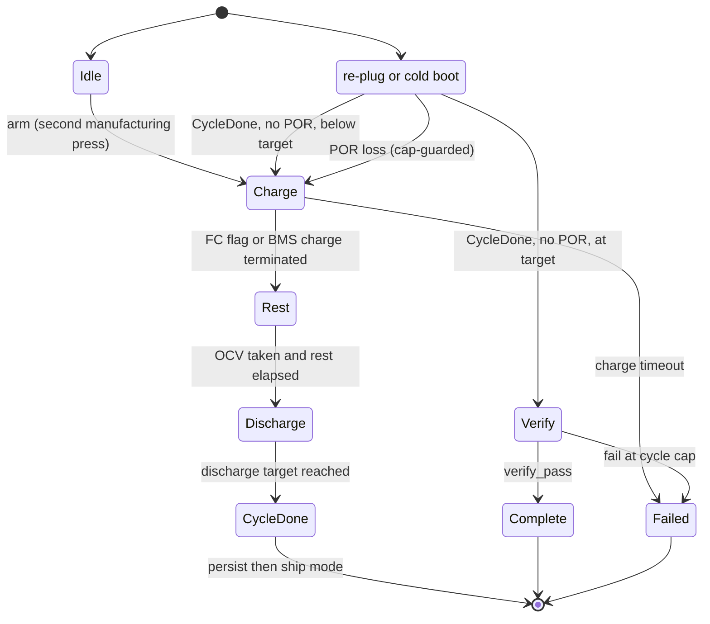
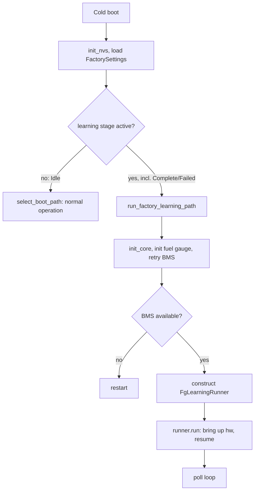
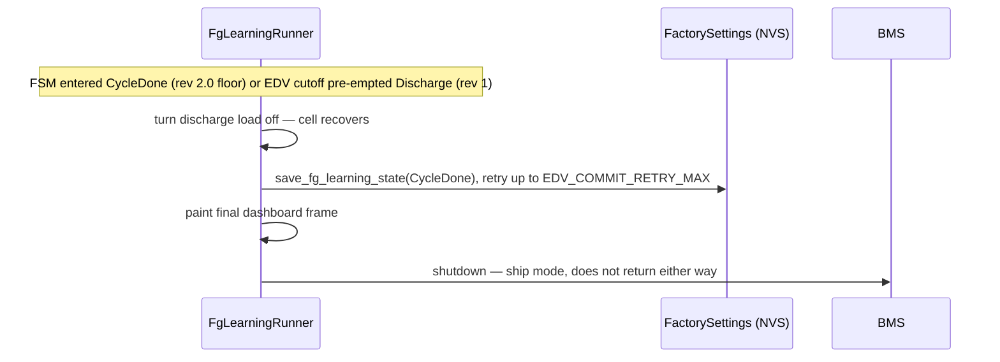

# Fuel-Gauge Learning

The AirGradient Go uses an Impedance-Track fuel gauge whose accuracy depends on
two learned values — `Qmax` (true cell capacity) and the `Ra` table (per-SOC
internal resistance). Board rev 1 carries a BQ27427; rev 2.0 carries a
BQ27742-G1, which keeps the same two learned values but reports progress and
ends its discharge differently (see
[Variant Differences](#variant-differences)). The gauge learns them only by observing clean
charge → rest → discharge → rest cycles. This is a **per-unit, end-of-line
operation**: a unit learns its own gauge once on the assembly line and never
again in the field. Learning runs in a **dedicated factory boot path** that
`GoApp::run()` routes into before normal boot-path selection. The path is
self-contained — it brings up only the display, LED, and buzzer, owns its own
poll loop, and never constructs the `Orchestrator` or any normal producer. The
run survives the end-of-discharge ship-mode power-off and resumes on re-plug
with no operator input, then verifies once after the final cycle and hands back
to normal operation.

## Files

| File | Purpose |
|---|---|
| [`fg_learning/fg_learning_controller.h`](../main/fg_learning/fg_learning_controller.h) | Pure FSM declaration (no hardware / ESP-IDF) |
| [`fg_learning/fg_learning_controller.cpp`](../main/fg_learning/fg_learning_controller.cpp) | FSM transitions, resume matrix, verify criteria |
| [`fg_learning/fg_learning_runner.h`](../main/fg_learning/fg_learning_runner.h) | Hardware-owning run declaration (target-only) |
| [`fg_learning/fg_learning_runner.cpp`](../main/fg_learning/fg_learning_runner.cpp) | Bring-up, poll loop, load stack, ship after CycleDone, dashboard, abort |
| [`go_settings.h`](../main/go_settings.h) / [`go_settings.cpp`](../main/go_settings.cpp) | `FactorySettings` persistence + boot predicate |
| [`go_power.h`](../main/go_power.h) / [`go_power.cpp`](../main/go_power.cpp) | `poll_bms_fg_learning`, verify read-back, charge / gauge control |
| [`go_display.h`](../main/go_display.h) / [`go_display.cpp`](../main/go_display.cpp) | `FgLearningDashboardData` + dashboard renderer |
| [`go_app.cpp`](../main/go_app.cpp) | Boot routing into the factory path |
| [`go_orchestrator.cpp`](../main/go_orchestrator.cpp) | The single arming branch |
| [`components/airgradient-bms/drivers/bq27427`](../../../components/airgradient-bms/drivers/bq27427) | Gauge learning reads / chemistry / Update-Status writes |

## Dependencies

| Dependency | Source | Usage |
|---|---|---|
| `FgLearningController` | `fg_learning` | Pure decision core owned and ticked by the runner |
| `PowerService` | `go_power` | Poll, charge / load control, gauge prerequisites, verify read, external watchdog, ship-mode shutdown |
| `DisplayService` | `go_display` | Full-screen learning dashboard |
| `LedService` | `led/go_led` | Phase-driven back-LED cue (amber / purple / blue / red / green) |
| `BuzzerService` | `buzzer/go_buzzer` | Unplug-alert melody |
| `ConfigStore` | `airgradient-config` (`config_store.h`) | `FactorySettings` load / save / clear |
| `GoBoard` | `go_board` | GPIO HAL for the abort-button read (`reboot()` is a free function) |
| `FuelGaugeDevice` / `BQ27427` / `BQ27742` | `airgradient-bms` | Learned-value reads and chemistry / Update-Status writes |

## Public API

### FgLearningController (Pure FSM)

| Method | Returns | Purpose |
|---|---|---|
| `load(stage, cycle, itpor_losses)` | `void` | Seed state from `FactorySettings` |
| `start()` | `void` | Arm a fresh run (`Charge`, cycle 1) |
| `reset()` | `void` | Clear to `Idle` |
| `resume_on_boot(snap)` | `bool` | Apply the boot resume matrix; true when a run continues |
| `tick(snap, now_ms)` | `FgLearningAction` | Advance one step and emit the action to apply |
| `on_verify_result(in)` | `bool` | Resolve verify → `Complete` / `Failed` / another cycle |
| `verify_pass(in)` | `bool` | Pure, static pass/fail check (host-tested) |

See [`fg_learning_controller.h`](../main/fg_learning/fg_learning_controller.h)
for `FgLearningAction`, `VerifyInputs`, and the accessors (`stage`, `cycle`,
`itpor_losses`).

### FgLearningRunner (Hardware Run)

| Method | Returns | Purpose |
|---|---|---|
| `FgLearningRunner(Deps)` | — | Inject services (power, display, led, buzzer, config, board) |
| `run()` | `[[noreturn]]` | Bring-up + resume + poll loop; never returns |

### PowerService (Learning-Facing)

| Method | Returns | Purpose |
|---|---|---|
| `poll_bms_fg_learning()` | `PowerSnapshot` | Normal poll plus the learning-only fields (progress and Design Capacity reads) |
| `read_fg_learning_verify()` | `FgLearningVerifyReadout` | Aggregate Qmax / Ra grid / Design Capacity / ITPOR / learned-Qmax flag |
| `set_charge_current_ma(ma)` | `bool` | Program ICHG |
| `set_manual_charge_disabled(disabled)` | `void` | Enable / disable the charge path |
| `set_chemistry_4v2()` | `bool` | Idempotent switch to Chem ID `0x1202` |
| `set_update_status_learning(enable)` | `bool` | Lift / restore the gauge change limits |

### Factory Settings

| Method | Returns | Purpose |
|---|---|---|
| `is_factory_learning_stage_active(stage)` | `bool` | Boot predicate — true for every stage except `Idle` (both terminals are sticky) |
| `load_factory_settings(store, out)` | `bool` | Read `fs_*` keys from the `"go"` namespace |
| `save_fg_learning_state(store, stage, cycle, losses)` | `bool` | Atomic single-commit run-state write |
| `clear_factory_settings(store)` | `bool` | Explicit clear (not called by `factory_reset()`) |

## Behavior

### Stages

The controller is driven, not autonomous. Each `tick()` derives the next stage
from the snapshot flags and returns an `FgLearningAction` for the runner to
apply. The run executes a fixed `CYCLE_TARGET` (default 2) full cycles before
verifying once.



### Cycle Timeline

The run repeats one full charge → rest → discharge → ship → re-plug cycle
`CYCLE_TARGET` (default 2) times, then verifies **once**. Each `Discharge`
starts at the **full** top and ends **empty** at the EDV cutoff, so the battery
is full only at the _start_ of a discharge.

```text
Arm
 └─ Cycle 1: Charge(empty->full) -> Rest(OCV1) -> Discharge(full->EDV) -> CycleDone -> ship
 re-plug   (cycle 1 below target -> next Charge)
 └─ Cycle 2: Charge(empty->full) -> Rest(OCV1) -> Discharge(full->EDV) -> CycleDone -> ship
 re-plug   (cycle 2 at target -> Verify)
 └─ Verify (battery empty, read-only) -> Complete / Failed
```

The boot resume matrix sequences this: on re-plug from `CycleDone`, `cycle below
target` returns to `Charge` (cycle + 1), while `cycle at target` enters
`Verify`. So `Verify` lands **right after the final re-plug, on the empty side** —
it keeps charge off and only reads the learned values back
(`read_fg_learning_verify()`); it does **not** recharge first. `OCV2` and the
Qmax recompute happen during the powered-off rest before that re-plug, so the
rest before re-plugging matters. For the rev 2.0 golden image leave the unit off
for at least 5 h, the point at which the gauge forces its OCV measurement if the
cell has not relaxed sooner (TRM SLUUAX0C §2.1). Across the two cycles the flags typically fill
in as: `OCV` first, `R` during cycle 1's discharge, `Q` once cycle 1 closes, with
cycle 2 refining both before `Verify`.

### Controlled Power Profile

The factory path runs no background producers, so the runner controls a
deliberate load stack per stage. Learning is gated by the gauge's battery-side
current thresholds (Quit Current 80 mA, Dsg Current Threshold 120 mA).

| Stage | Charge | Toggled loads (PM + CPU duty) | Resulting profile |
|---|---|---|---|
| `Charge` | on, ICHG 1500 mA | off | Charger-dominated |
| `Rest` | off | off | Quiet — under 80 mA for clean OCV1 |
| `Discharge` | off | PM + CPU duty on | Steady draw above the 120 mA threshold |
| `Verify` | off | off | Quiet |

GPS is **never managed** by the factory path (the TAU1113 has no power GPIO and
auto-acquires at power-on), so its steady ~16–21 mA is always present and stays
under the Quit Current during the quiet stages. The discharge stack adds the PM
fan plus a deliberate CPU-active duty so battery-side current clears the
discharge threshold; the margin grows as the cell drains.

The CPU duty is **sustained**, not a one-shot burst: during `Discharge`,
`idle_poll()` spends most of every `ABORT_POLL_MS` slice in a busy-spin
(`FG_LEARNING_CPU_ACTIVE_MS`, ~90 %) and yields the remainder as a real RTOS
delay so the idle task runs and the Task WDT stays fed. A brief burst only
spikes the gauge's _instantaneous_ current; the gauge qualifies `DISCHARGE` on
_averaged_ current, so the load must be held high across the whole inter-poll
window. `Rest`/`Verify` keep `_discharge_load_on` false, so those waits stay
quiet (idle sleep, under the Quit Current) for clean OCV.

The PM fan is the primary load: powering the EN_PM rail alone does not spin it —
the SPS30 must be told to measure. On `Discharge` the runner powers EN_PM and
then calls `GoBoard::start_pm_fan()` every poll until it reads back a valid
measurement (proof the fan is actually running), so a slow sensor boot or a
transient I²C error self-recovers instead of leaving the discharge load short.

Unplugging the charger flips PMID (the rail feeding the EN_PM load switch hands
off from input to OTG boost), which browns the SPS30 out of measuring mode even
though EN_PM stays asserted — the fan stops. The runner detects the unplug edge
(`external_input_present` true → false) during `Discharge` and forces a full PM
re-enable (`stop_pm_fan()` clears the inited flag), so the per-poll
`start_pm_fan()` retry re-inits the sensor and the fan resumes within one poll.

### Manual-Intervention Cues (LED + Buzzer)

The pure FSM emits a `ManualCue`; `FgLearningRunner::apply_action()` maps it to
one **solid** back-LED colour (`LedService::back_solid()`), and
`handback_terminal()` lights the terminal colour. So an operator servicing a
rack can see at a glance what each unit needs.

| Phase | Back LED | Buzzer | Operator action |
|---|---|---|---|
| `Rest` | Solid amber `{255,140,0}` | — | Wait — OCV settling |
| `UnplugPrompt` (Discharge, plugged) | Breathing purple `{160,0,255}` | `PATTERN_UNPLUG` melody once on entry | Unplug the charger |
| `Discharging` (Discharge, unplugged) | Solid blue `{0,0,255}` | — | Wait — draining to EDV |
| `Complete` (terminal) | Solid green `{0,255,0}` | — | Pass — press POWER to exit |
| `Failed` (terminal) | Solid red `{255,0,0}` | — | Reject — press POWER to exit |
| Charge / CycleDone / Verify / Idle | Off | — | None — automatic |

Both terminal screens show `Press POWER to exit` at the bottom; the `Failed`
screen also shows `FAIL: <reason>` under the banner. The exit gesture is the
same short POWER press on both, pairing each result LED with a discoverable cue.

**Re-plug has no LED.** By the time the operator must re-plug, the device has
reached EDV, persisted `CycleDone`, and entered ship mode (powered off) — an LED
is impossible. The re-plug cue is therefore the `Discharge complete` screen,
painted as the last frame before power-off. On re-plug the run auto-resumes with
no operator input (next cycle's `Charge`, or `Verify` after the final cycle). For
a clean OCV2, leave the unit powered off for at least 5 h before re-plugging —
that rest is the second of the two points a Qmax update needs.

### Boot Routing and Resume

`GoApp::run()` gains a single early branch before `select_boot_path()`. Only the
lightweight, idempotent `init_nvs()` is needed to read `FactorySettings`; the
heavy `init_core()` happens inside the factory path.



`resume_on_boot()` loads `FactorySettings` into the controller, applies the
idempotent gauge prerequisites (`set_chemistry_4v2()`; Update-Status learning
bits on cycle 1), takes one poll, and runs the controller's resume matrix. The
loss signal during resume is `fg_itpor` alone — `qmax_up` is legitimately `0`
for all of cycle 1, so gating on it would misclassify a benign mid-cycle reboot.
The factory path requires the BQ25629: it makes two initialization attempts
100 ms apart and restarts instead of constructing the runner when both fail.

### CycleDone / Ship-Mode Integration

`ship_after_cycle()` owns the persist-then-ship sequence and runs on both
variants as soon as the FSM has entered `CycleDone`. The bottom rest (OCV2) has
to happen powered off: a cell at the discharge floor cannot feed the system for
the hours the gauge needs to relax, and the shipped device draws nothing from
it. Re-plug reboots into the resume matrix, which carries the run on.

On rev 1 the firmware EDV cutoff pre-empts the stage from `handle_edv_ship()`
before the FSM ever sees `CycleDone`, and the same sequence runs. **Battery
safety beats resumability**: continuing to drain a cell already at the cutoff is
the over-discharge the trip exists to prevent.



The shared EDV detection in `poll_bms()` is unchanged and still protects shipped
units. Because the EDV trip is sample-count based, the wall-clock debounce in the
factory path is `3 x` the runner poll cadence. The rev 2.0 floor
(`FG_LEARNING_DISCHARGE_END_MV`) is a single gauge reading; near-empty the
discharge curve is steep enough that a momentary dip only moves the end by
minutes, and the gauge's own Update Status decides whether the cycle counted.

### Watchdogs

The device is awake for the whole multi-hour run, so the runner feeds the
external hardware watchdog itself: `feed_ext_watchdog()` calls
`PowerService::reset_ext_watchdog()` well inside the ~60 s window. The BQ25629
charger watchdog is disabled at BMS init and needs no servicing.

### Self-Sufficient Display

The runner builds a `DisplayValues` directly (no `UIManager`) — setting
`show_fg_dashboard`, the `FgLearningDashboardData`, and the matching
`Screen::FgLearn*` value — and calls the public `update_sync()`.
`DisplayService::_render_frame()` dispatches to the private
`_draw_fg_learning_dashboard()`. The policy is full refresh only, EPD deep-sleep
between paints, a `FG_LEARNING_DISPLAY_REFRESH_MS` (60 s) heartbeat plus a paint
on every stage transition and on any charging-state / plug change (so a
plug/unplug shows within a poll, not a heartbeat). FCC drift is shown against the
Design Capacity the gauge is configured with, read once per learning poll into
`PowerSnapshot::fg_design_capacity_mah`, so the two cell variants each show their
own number.

The frame shows a bold phase banner (two-word stages wrap to two lines), the
`Cycle n/N` line, the SOC / voltage / signed-current block, the capacity /
temperature / flag rows, and a bottom **`HH:MM` per-stage elapsed clock**
(`stage_elapsed_ms`). That clock is wall-clock since the device entered the
current stage **this power session**, so it resets across the ship-off / re-plug
(it is a per-stage timer, not a cumulative run timer).

### Learning-Progress Flags (OCV / Q / R)

The dashboard's `Q R OCV` row is the gauge's own report of how far Impedance
Track has gotten. `poll_bms_fg_learning()` packs these three bits into
`fg_learning_flags`. All three come
from `FuelGaugeDevice::read_learning_progress()`, which each driver fills from
whichever registers its part keeps them in:

| Display | Meaning | Constant | BQ27427 source | BQ27742 source |
|---|---|---|---|---|
| `OCV` | OCV taken | `FG_LEARN_OCV_TAKEN` | `Flags()` bit 7 | `CONTROL_STATUS` bit 15 (`Flags()` bit 7 is `CHG_SUS` on this part) |
| `Q` | a Qmax was learned | `FG_LEARN_QMAX_UP` | `CONTROL_STATUS` QMAX_UP | Update Status bit 0 or 1 |
| `R` | Ra learned, cycle done | `FG_LEARN_RES_UP` | `CONTROL_STATUS` RES_UP | Update Status bit 1 |

- **`OCV` — OCV taken.** The cell's _rested_ open-circuit voltage, measured once
  current has stayed below the Quit Current long enough to relax. It anchors
  the cycle: learning needs two points — **OCV1** at the rested top (after
  charge → rest) and **OCV2** at the rested bottom (after discharge → ship-off
  rest). The bit only says an OCV _was measured_ in this relaxation; the gauge
  will not use the point for Qmax until the cell has relaxed to dV/dt < 1 µV/s,
  which it checks from 60 s after relaxation entry and forces after 5 h. This is
  why `Rest` waits for `OCVTAKEN` _and_ a floor
  (`PowerService::fg_learning_rest_min_ms()`: 500 s on rev 1, 2 h on rev 2.0,
  the relax TI's learning cycle asks for), and why the quiet stages must stay
  under the Quit Current.
- **`Q` — Qmax updated.** `Qmax` is the cell's _true full capacity_, computed
  from the coulombs counted between two relaxed OCV points at known
  depth-of-discharge. `QMAX_UP` sets only after a qualified discharge bounded by
  two OCVs lets the gauge recompute it, so it is **legitimately 0 for all of
  cycle 1**. (That is exactly why resume keys off `fg_itpor`, not `qmax_up`.) It
  is verify criterion 2, and the learned `qmax_mah` must land within
  `[0.7×, 1.4×]` of design capacity.
- **`R` — Ra updated.** `Ra` is the per-SOC internal-resistance grid (15 points,
  `RA_TABLE_SIZE`) used to predict voltage under load. `RES_UP` sets after the
  **first** Ra entry moves during a qualified discharge — it is **not** a
  "fully learned" signal, so verify criterion 4 inspects the _whole_ grid rather
  than trusting `RES_UP`. Ra is learned in `Discharge`, at temperature (hence the
  ~25 °C target there).

Healthy progression differs by variant. On rev 1 `OCV` flips first, `R` turns on
during the first qualified discharge, and `Q` once the full cycle closes. On
rev 2.0 both `Q` and `R` come from Update Status, so `Q` appears at `0x05`
(after the charge and its rest) and `R` only at `0x06` (after the discharge
**and** the rest that follows it). `Q0 R0 OCV1` all through a rev 2.0 discharge
is therefore expected, and `Q0` after a rest means that rest was too short for
the gauge to qualify the OCV point, not that the run has failed.

### Persistent Journal (NAND)

A 2-cycle run spans ~1 day and many reboots / ship-cycles, and the charge ⇄
discharge handoffs make live serial capture unreliable. `FgLearningJournal`
(target-only) solves this with an **append-only text log on the SPI-NAND FATFS
mount** (`/nand/fglearn.log`), mounted by reusing `board.storage()`:

- **Replay on every boot and at the terminal result.** `run()` calls
  `dump_to_serial()` at bring-up and `handback_terminal()` dumps again, so a
  console connected at _any_ point — even at a terminal screen — prints the whole
  run history. Because both terminals are sticky, simply power-cycling a finished
  unit re-dumps the log; this is the answer to "I already lost the logs."
- **Event-driven, never per-poll.** Lines are written only on boots, stage
  transitions, learning-flag edges, verify, EDV-ship, and the result — a few
  dozen writes per run, each `fsync`'d so a sudden reset loses at most the
  in-flight record. NAND wear stays trivial.
- **Survives power-off / ship mode** (unlike RTC memory), so the trail
  accumulates across the whole multi-reboot run.

Logged events (`FGJ #seq <uptime>s ...`):

| Event | When | Key fields |
|---|---|---|
| `BOOT` | every boot | **`esp_reset_reason()`**, resumed stage/cycle/itpor, ITPOR-now, soc, vbat |
| `STAGE` | stage transition | stage, cycle, soc, vbat |
| `FLAG` | first ITPOR / QMAX_UP / RES_UP / DSG_QUALIFIED | name, soc, vbat, current |
| `EDV_SHIP` | before ship at the EDV cutoff (rev 1 pre-emption) | cycle, soc, vbat |
| `TARGET_SHIP` | before ship at `CycleDone` (discharge floor) | cycle, soc, vbat |
| `VERIFY` | verify runs | all criteria + pass + failing reason + full Ra grid |
| `RESULT` | terminal | stage + fail reason |

The `BOOT` line is the only place the **ESP reset reason is logged on the
learning path** (the normal `go_app` reset-reason log is skipped because the
learning path is entered first and never returns). The journal is truncated only
on the deliberate exit (short power press), so it survives sticky power-cycles.

### Failure Reason

When a run ends in `Failed`, `FgLearningController` records a `FgLearnFailReason`
(charge timeout, POR-loss cap, or the specific verify criterion that tripped —
`QmaxNotUpdated`, `RaInvalid`, `QmaxOutOfBand`, etc.). It is **persisted** (NVS
`fs_r`) so it survives the sticky-Failed reboot, surfaced on the `Failed`
dashboard as `FAIL: <reason>` under the banner, and written to the journal
`RESULT` line — so the cause is visible from the e-paper alone, with no serial.

### Arming

Manufacturing mode is ephemeral (not persisted), so arming is a runtime gesture
on a fresh unit (`onboarding_done == false`):

```text
1st boot short-press -> enter_manufacturing_mode (existing)
2nd boot short-press -> save_factory_settings(Charge, cycle 1) + reboot
```

The reboot lands in `GoApp::run()`'s early branch, which routes into the factory
path. The orchestrator owns none of the run — no tick, resume, verify, ship
hook, or dashboard.

### Terminal Handback

Both terminal stages are _active_ (sticky) so a finished unit cannot be silently
shipped and a missed serial dump can always be re-read:

- The unit re-enters the factory path and re-shows its result screen (and
  re-dumps the journal) on **every** boot until an operator presses POWER.
  `FactorySettings` survives `factory_reset()`, so a terminal unit cannot
  accidentally look normal.
- A short **POWER press** is the only exit, identical for both: `reset()` +
  `clear_factory_settings()` + journal truncate, then reboot to normal operation
  (the learned `Qmax` / `Ra` stay in the gauge IC). Only the result LED (green /
  red) and screen text differ.

`handback_terminal()` performs idempotent cleanup (restore charge, PM off, clear
the Update-Status learning bits), persists the terminal stage, paints the result
frame, lights the result LED (green / red), and holds until the POWER press.

## Edge Cases / Errors

- **CycleDone commit fails before ship:** the runner retries up to
  `EDV_COMMIT_RETRY_MAX`, then ships regardless — ship mode is a safe power-off,
  and the lost cycle is recovered by the resume / POR-loss path on re-plug. The
  runner never lingers discharging at the cutoff.
- **POR during a run:** `fg_itpor` triggers a cap-guarded restart; after
  `ITPOR_LOSS_CAP` (3) losses the run trips `Failed` for investigation.
- **`FC` never latches** (chemistry / Taper-Voltage mismatch): `Charge` also
  advances when the BMS terminates charge after charging was actually observed,
  so OCV1 is still captured at the relaxed top. That fallback is **rev 1 only**,
  because `ChargeTerminationDone` is produced by the rev 1 charger driver and
  the rev 2.0 one has no state that means terminated. Rev 2.0 therefore depends
  on `FC` alone, which is why the board programs the gauge's Charging Voltage to
  match the charger: on TI's 4350 mV default the flag could never set and the
  run sat in `Charge` until the 8 h timeout.
- **Chemistry already correct:** `set_chemistry_4v2()` reads the Chem ID first
  and only writes when it differs — changing chemistry resets IT learning, so it
  must never run on an already-learned unit.
- **No fuel gauge attached (Prototype):** the gauge prerequisites and verify read
  return false; a Prototype board has no learning surface and never arms a run.
- **Invalid gauge data:** the dashboard renders `FG: NO DATA` when the SOC
  sentinel indicates no valid read.
- **Abort:** a short power press (during a run or in a terminal hold) calls
  `reset()` + `clear_factory_settings()` and reboots into normal operation.
- **Boot cost:** every normal fast / button-wake boot now pays one `init_nvs()`
  plus a single key read before path selection; confirm on hardware that this is
  not measurable.

## Golden Image

A learning cycle takes the better part of a day, so only **one** unit per cell
design runs one. Everything it learns is copied off it and compiled into the
firmware, and every other unit installs that image at first boot instead of
learning. This is TI's own production flow, and the chip is built for it: TRM
§5.7 permits writing the Ra tables for exactly this purpose, and §5.5.3.2
describes the golden file carrying Update Status `0x02`.

What transfers, and what does not:

| Field | Where | Transferable |
|---|---|---|
| Qmax Cell 0 | subclass 82 offset 0 | yes |
| Ra0 and Ra0x, both flags | subclasses 88 and 89 | yes |
| Update Status | subclass 82 offset 2 | as `0x02`; bit 2 only ever via `IT_ENABLE` |
| Cell config, Safety, protector, Charging Voltage | several | already written on every boot |
| Chem ID | subclass 83 | **no** — writing it has no effect, it takes TI's bqCONFIG (TRM §5.6.1.1) |

Chemistry is the one thing firmware cannot install, and the one thing that does
not need installing: every gauge leaves the factory with the same chemistry, so
the unit that learns and the units that receive its image already agree. The
rule that follows is simply never to change it.

### The two builds

`AGO_FG_GOLDEN_V2` in [`go_hardware_board.cpp`](../main/go_hardware_board.cpp)
decides which build this is, and `fg_golden_image_valid()` is the test.

- **Characterisation build** — the constant is empty. A virgin gauge gets Qmax
  seeded with the design capacity; Impedance Track stays off until a learning
  run is armed. Once that gauge has learned, every boot prints its image as a C
  initialiser, ready to paste into the constant.
- **Production build** — the constant is filled in. A virgin gauge has the whole
  image written and read back, and only then is `IT_ENABLE` sent.

`fg_decide_install()` in [`bms_types.h`](../../../components/airgradient-bms/types/bms_types.h)
owns that choice and is host-tested over the whole state matrix. Two of its
cells are the ones worth knowing:

- Update Status **`0x00`** is the only state anything is written in, so a gauge
  that holds learned values is never written over, and a unit that has been
  learning in the field keeps what it learned.
- Update Status **`0x02`** means a previous boot wrote the image and then failed
  to start Impedance Track. It is an unfinished install, not a gauge to leave
  alone, so the next boot sends `IT_ENABLE` again. Reading it as "already
  started" would have shipped the unit with gauging switched off for good.

`IT_ENABLE` latches `QEN` for the life of the part, which is why it runs last,
only behind a verified image, and why `set_update_status_learning()` confirms
the bit by reading Update Status back rather than trusting the I²C write — this
gauge has been seen to report a failure on a subcommand that landed.

### Capturing an image

Run a learning cycle to `Complete`, then read the three log lines the
characterisation build prints at every boot:

```text
BQ27742 golden image: .qmax_mah = 2543, .update_status = 0x02,
BQ27742 golden image: .ra0 = {0x0055, {301, 302, ...}},
BQ27742 golden image: .ra0x = {0xFF00, {291, 292, ...}},
```

The dump refuses to recommend itself until Update Status reads `0x06`, and
`fg_golden_image_valid()` rejects a profile whose flag still says ROM defaults,
so a capture taken mid-cycle cannot quietly become the image. A filled-in
constant is checked again at compile time by a `static_assert`.

Paste them into `AGO_FG_GOLDEN_V2`, rebuild, and validate the result on a second
unit before committing to a production run: install the image, then compare the
gauge's reported SOC against a measured discharge. Under 3 % error is the bar.

An image is tied to the cell model and vendor. Changing either means running a
new cycle.

## Variant Differences

The FSM and the runner are variant-neutral. Everything that differs between the
two gauges is resolved below them, either in the driver or in `PowerService`.

| Concern | Board rev 1 (BQ27427) | Board rev 2.0 (BQ27742-G1) |
|---|---|---|
| Learning progress | `CONTROL_STATUS` QMAX_UP / RES_UP | Update Status byte, `0x04` → `0x05` → `0x06` |
| OCV taken | `Flags()` bit 7 | `CONTROL_STATUS` bit 15; `Flags()` bit 7 is `CHG_SUS` |
| `IT_ENABLE` | Update Status learning bits, set and cleared | sent once at cycle-1 entry; skipped when Update Status bit 2 is already set, never undone |
| Qmax Cell 0 units | Q14 fraction of Design Capacity | mAh |
| Seeding Qmax | left to the gauge | board writes Design Capacity while Update Status is 0 |
| Rest floor after charge | 500 s (`FG_LEARNING_REST_MIN_MS`) | 2 h (`FG_LEARNING_REST_MIN_PROTECTED_MS`), the golden image is taken once so time is cheap |
| End of the discharge half | firmware EDV cutoff at 2.9 V | cell reaches `FG_LEARNING_DISCHARGE_END_MV` (3.0 V); the run persists `CycleDone` and ships the same way |
| Undervoltage cutoff | firmware at `EDV_SHIP_THRESHOLD_V` | firmware at `EDV_SHIP_THRESHOLD_PROTECTED_V`, with the gauge's UV Prot as backstop, see [`bq27742_capability.md`](bq27742_capability.md) |
| Gauge current thresholds | Quit 80 mA, Dsg 120 mA (configured) | factory defaults, Quit 40 mA, Dsg 60 mA, Chg 75 mA (TRM subclass 81); firmware never writes them and the bench has not read them back |
| End of the charge half | `FC`, or the charger reporting termination | `FC` only; the board programs Charging Voltage 4200 mV so the flag can set |

Two consequences are worth stating plainly.

`PowerSnapshot::discharge_target_reached` is what the FSM reads, and
`PowerService` derives it per variant from `Config::fg_has_protector`.
`edv_cutoff_reached` still exists as the trigger for
`FgLearningRunner::handle_edv_ship()`, and both variants can set it. On rev 2.0
it sits at 2.85 V, below the 3.0 V floor the discharge half stops at, so a normal
run reaches `CycleDone` first and the EDV path is only the fallback for a run
that somehow keeps draining.

The rev 2.0 discharge therefore ends 300 mV above the gauge's undervoltage trip
rather than at it. That margin is what lets the run persist its stage before
shipping instead of losing power at the cutoff with nothing saved. The golden
image is taken from this unit's data flash at Update Status `0x06`; the
per-unit path is then a flash of that image, not a learning run.
