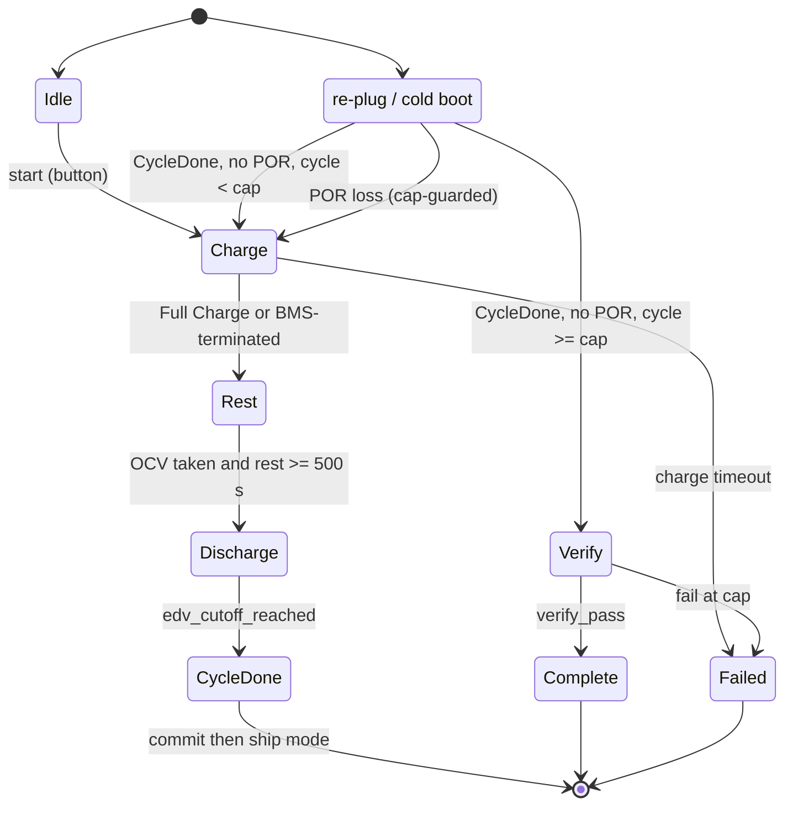
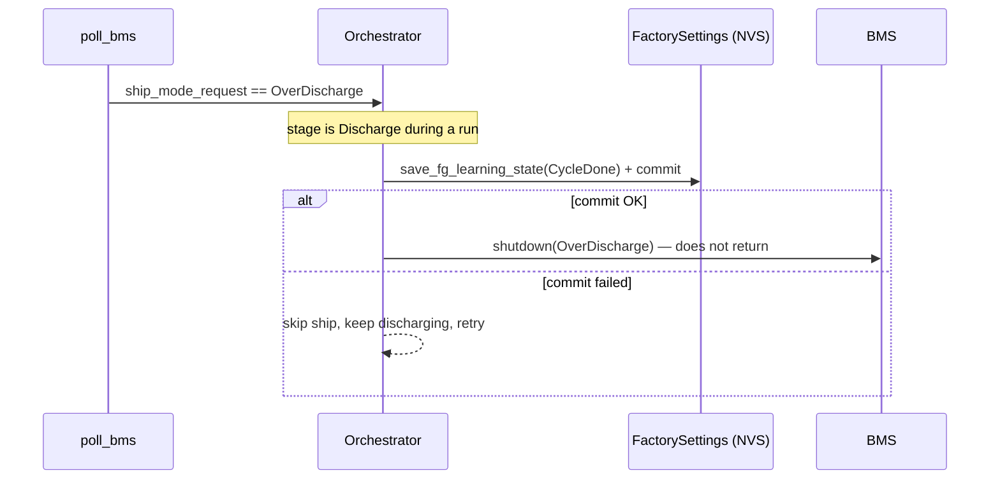

# Fuel-Gauge Learning

Automated, per-unit end-of-line learning for the V1 board's BQ27427
Impedance-Track fuel gauge. An operator arms the run with one button; the
device then drives it autonomously across one or more full charge → rest →
discharge → rest cycles, an end-of-discharge (EDV) ship-mode power-off,
cold-boot resumes, and a final pass/fail verification. The only manual
actions are unplugging and re-plugging the charger when the device asks.

The decision logic is a pure, host-testable state machine
(`FgLearningController`); the orchestrator owns the hardware-facing wiring
that drives it.

## Files

| File | Purpose |
|---|---|
| [`fg_learning_controller.h`](../main/fg_learning_controller.h) | Pure FSM, action / verify-input types, `ManualCue` |
| [`fg_learning_controller.cpp`](../main/fg_learning_controller.cpp) | Stage transitions, resume matrix, `verify_pass` |
| [`go_settings.h`](../main/go_settings.h) / [`.cpp`](../main/go_settings.cpp) | `FgLearningStage`, `FactorySettings`, persistence |
| [`go_power.h`](../main/go_power.h) / [`.cpp`](../main/go_power.cpp) | Snapshot flags, `read_fg_learning_verify`, charge / load setters |
| [`go_orchestrator.cpp`](../main/go_orchestrator.cpp) | Tick wiring, EDV pre-ship hook, trigger, terminal cleanup |
| `components/airgradient-bms/drivers/bq27427/` | Driver learning reads / writes, 4.2 V chemistry select |

## Dependencies

| Dependency | Source | Usage |
|---|---|---|
| `PowerSnapshot` | `go_power.h` | FSM input (FG flags, power source, EDV mirror) |
| `Screen` | `go_display.h` | Phase-banner screen carried on the action |
| `FactorySettings` | `go_settings.h` | Persisted run state in the `"go"` NVS namespace |
| `BQ27427` | `airgradient-bms` | Gauge learning surface (concrete, target only) |
| `LedService` / `BuzzerService` | `go_led.h` / `go_buzzer.h` | Operator cues |

## Public API

The FSM is driven, not autonomous. Each `tick()` derives the next stage from
the snapshot and returns an `FgLearningAction` for the orchestrator to apply.

```cpp
void load(FgLearningStage, uint8_t cycle, uint8_t itpor_losses);
void start();                                   // arm: Charge, cycle 1
void reset();                                   // back to Idle
bool resume_on_boot(const PowerSnapshot &snap); // re-enter at boot
FgLearningAction tick(const PowerSnapshot &snap, uint32_t now_ms);
bool on_verify_result(const VerifyInputs &in);
static bool verify_pass(const VerifyInputs &in);
```

The orchestrator wiring lives in `tick_fg_learning`,
`apply_fg_learning_action`, `persist_fg_learning_state`,
`run_fg_learning_verify`, and `resume_fg_learning_on_boot`. See the
[Orchestrator doc](orchestrator.md#fuel-gauge-learning) for call sites.

## Behavior

Learning is gated by the gauge's three independent current thresholds (Quit
Current ≈ 80 mA for relaxation, Dsg Current Threshold ≈ 120 mA for
discharge), not by SLEEP. Each phase produces the load profile the gauge
needs: quiet current at the open-circuit-voltage windows, and sustained
discharge current above the Dsg threshold for the discharge.

### Stages



Per-stage charge / load intent and operator cue:

| Stage | Charge | Load | Cue / Screen |
|---|---|---|---|
| `Charge` | on, 1500 mA | full | none / Charging |
| `Rest` | off | quiet | none / Resting |
| `Discharge` | off | full | amber unplug / Unplug |
| `CycleDone` | off | full | none / Discharge complete |
| `Verify` | off | quiet | none / Verifying |
| `Complete` | normal | normal | green / Complete |
| `Failed` | normal | normal | red / Failed |

The run always completes `CYCLE_TARGET` (default 2) full cycles before
judging the gauge; it is not early-exited on an apparently-learned earlier
cycle.

### Boot Resume

`resume_fg_learning_on_boot()` runs once at `init()`, after the first
`poll_bms()` so the snapshot carries fresh FG flags. It re-enters the FSM
only when a run is genuinely in progress (`stage` not in `Idle`, `Complete`,
`Failed`), so a normal field unit is never hijacked. The loss signal during
resume is `fg_itpor` alone — never `qmax_up`, which is legitimately `0`
through all of cycle 1. After `ITPOR_LOSS_CAP` (3) POR-loss restarts the run
ends in `Failed`.

### Verify Criteria

`verify_pass()` requires all of: no POR since learning (`itpor == 0`),
`qmax_up == 1`, learned Qmax within `[0.7 x DC, 1.4 x DC]` of design
capacity, and a healthy Ra grid (every entry positive and moved off ROM
defaults).

### EDV / Ship-Mode Integration

The discharge ends at the existing EDV trip (cell below 2.9 V). The
orchestrator's BMS poll persists `CycleDone` (committed) **before** ship
mode; if the commit fails it does not ship — it keeps discharging and
retries on the next poll. There is exactly one shutdown path, so the FSM and
the EDV hook cannot disagree.



### Terminal Cleanup

Entering `Complete` or `Failed` restores normal charge / load, clears the
gauge Update Status learning bits, persists the terminal stage, and paints
the result LED — then goes inactive. Cleanup is idempotent.

### Trigger and Reset

Arming reuses the manufacturing entry path on a fresh unit
(`onboarding_done == false`): the first Button-Boot short press enters
ephemeral Stationary, and a second short press arms the run. While a run is
active the device stays awake and suppresses Stationary Wi-Fi / cloud so the
radio does not perturb the load profile. The Button-Boot long-press
factory-reset gesture also clears the run, but **only** when it is `Failed`;
a `Complete` (learned) unit's result is preserved.

## Edge Cases / Errors

- **`FC` never latches** (chemistry / Taper-Voltage mismatch): the Charge
  stage also advances on a BMS charge-termination once charging was actually
  observed, and logs a warning.
- **Spurious mid-run reset on battery** (no POR): resume continues the
  discharge rather than restarting the cycle.
- **`CycleDone` commit failure at EDV**: the device does not ship; it keeps
  discharging and retries, so learning is never lost to a half-written NVS.
- **Chemistry**: `select_chemistry_4v2()` is idempotent and runs at FG
  bring-up before any run; switching Chem ID resets IT learning, so it must
  not run on an already-learned unit.
- **Bench-pending**: `CONTROL_STATUS` `QMAX_UP` / `RES_UP` bit positions, the
  Dsg Current Threshold restore policy, and the Ra moved-off-defaults
  tolerance are marked `TODO(bench)` in the code.
