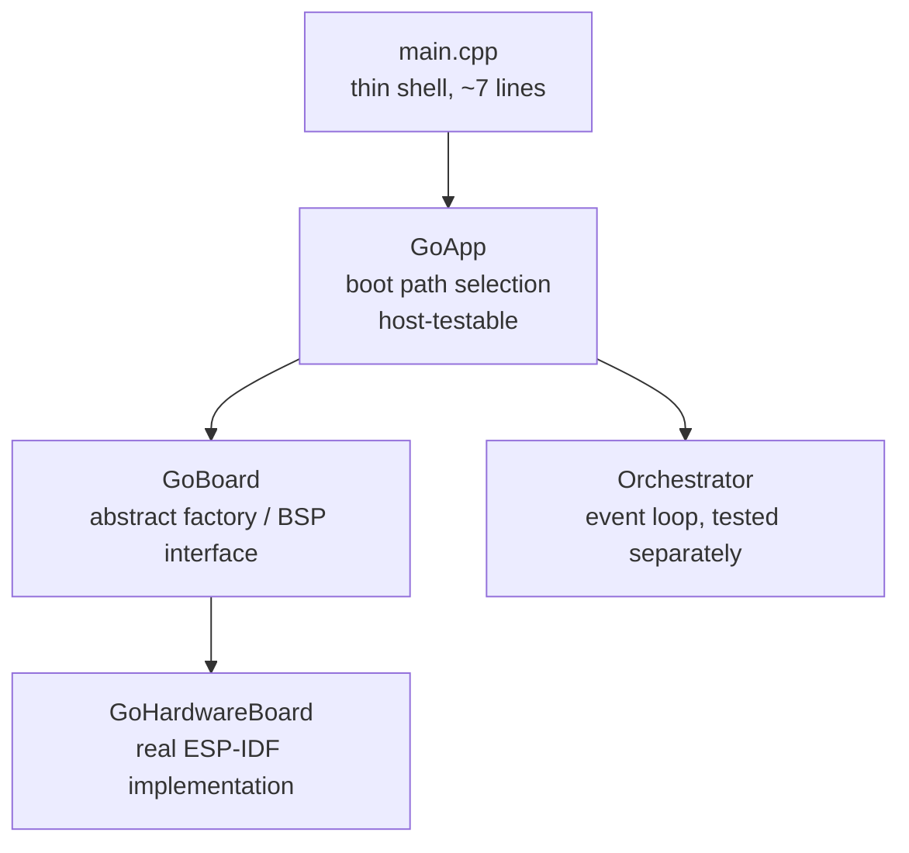

# Hardware Initialization

Boot path selection, hardware initialization, and fast-path boot for the
AirGradient Go product. Hardware initialization is encapsulated in
`GoHardwareBoard` (real ESP-IDF implementation of the `GoBoard` interface).
Boot path logic lives in `GoApp`. Pin assignments are in `board_config.h`.

## Files

| File | Purpose |
|---|---|
| `main/main.cpp` | Thin shell: constructs `GoHardwareBoard` + `GoApp`, calls `run()` |
| `main/go_board.h` | Abstract `GoBoard` interface (init methods, service accessors, factories) |
| `main/go_hardware_board.h` | `GoHardwareBoard` class declaration |
| `main/go_hardware_board.cpp` | Real ESP-IDF init calls, driver creation, bus management |
| `main/go_app.h` | `GoApp` class, `select_boot_path()`, pure utility functions |
| `main/go_app.cpp` | Boot path logic, `execute_fast_path()`, service wiring |
| `main/board_config.h` | Pin assignments and peripheral constants |
| `main/go_types.h` | `BootHandoff`, `RtcAppState`, `WakeCause`, `LockState` |

## Architecture



| Layer | Responsibility | Testable on host? |
|---|---|---|
| **main.cpp** | Construct board, construct app, call `run()` | No |
| **GoApp** | Boot path selection, fast-path logic, service construction, orchestrator launch | **Yes** |
| **GoBoard** | Abstract interface for hardware object creation | N/A (interface) |
| **GoHardwareBoard** | All ESP-IDF init, driver creation, bus management | No |

## Boot Path Selection

`GoApp::run()` determines the boot path using the pure function
`select_boot_path()`:

```text
GoApp::run():
    cause = PowerService::get_wake_cause()
    path = select_boot_path(cause, load_rtc_app_state())

    switch (path):
        FastPath    → run_fast_path(state)
        ButtonWake  → run_button_wake_path(state)
        Interactive → run_interactive(cause, {})
```

| Wake Cause | Condition | Path |
|---|---|---|
| `PowerOn` | -- | `Interactive` with empty BootHandoff |
| `Timer` + `Locked` | `is_fast_path_wake()` | `FastPath` — measure, display, sleep or promote |
| `Timer` + `Unlocked` | Not fast-path eligible | `Interactive` |
| `Button` + `Offline` | -- | `ButtonWake` — four-phase early paint |
| `Button` + non-Offline | -- | `Interactive` |

### load_rtc_app_state()

Free function declared in `go_power.h`, implemented in `go_power.cpp`. Reads
`RTC_DATA_ATTR` static variables that `PowerService::save_state()` /
`load_state()` use. Safe to call before any peripheral init because it has
no hardware dependencies.

## GoBoard Interface

The `GoBoard` abstract interface provides:

### Init Methods (Idempotent)

Each initializes one subsystem. Successful initialization is idempotent;
`init_bms()` remains retryable after failure. Boot paths call these in the order
their hardware sequencing requires.

| Method | What it initialises |
|---|---|
| `init_nvs()` | NVS flash |
| `init_buses()` | GPIO power enables + I2C bus + settling delays + board variant detection (BQ27427 probe) + PM polarity write |
| `init_spi()` | SPI bus |
| `init_fuel_gauge()` | Optional BQ27427 driver on V1 (requires buses), with corruption recovery + idempotent cell-config; independent from the charger |
| `init_bms()` | BQ25629 charger driver (requires buses); returns availability and remains retryable after failure |
| `init_wifi_subsystem()` | ESP-IDF Wi-Fi stack: netif, event loop, `esp_wifi_init`, storage mode, event handlers, single-shot timers. **Not** called by `init_core()` — only `Orchestrator::enter_stationary()` invokes it, so Portable-only boots never pay the cost. Idempotent at both the board layer (`_wifi_inited` flag) and the HAL layer. |
| `init_core()` | Convenience gate: calls `init_nvs` + `init_buses` + `init_spi` (skips what's done). Deliberately excludes fuel-gauge, BMS, and Wi-Fi initialization. |

### Lazy service accessors

Create-on-first-call. Objects are owned by the board and live for the
process lifetime (never freed — the app never returns).

| Accessor | What it creates | Prerequisites |
|---|---|---|
| `config_store()` | NvsConfigStore | NVS |
| `load_settings()` | Loads GoSettings from NVS | NVS (via config_store) |
| `bms()` | Returns the initialized `BmsDevice`, or `nullptr` after failed initialization | BMS init attempted |
| `sensors(warm)` | All sensor drivers + SensorManager | Buses, BMS attempted, PowerService constructed |
| `storage()` | PayloadCache + NAND + StorageService | SPI |
| `display()` | DisplayService | SPI |
| `led_service()` | LedService (LP5036 driver on V1, inert on Prototype) | Buses |
| `power()` | PowerService + ext watchdog; accepts a nullable BMS and optional fuel gauge | Fuel-gauge and BMS init attempted |
| `wifi_hal()` | `EspWifiHal` instance | — (lazy C++ construction only; ESP-IDF Wi-Fi init runs in `init_wifi_subsystem()`) |
| `wifi_manager()` | `WifiManager` constructed against the HAL | `wifi_hal()` — the manager's constructor only registers callbacks, so construction against an uninitialised HAL is safe; driver calls fire when `WifiService` actions run |
| `http_server()` | `IdfHttpServer` for the Wi-Fi captive-portal transport | — (lazy) |
| `ble_server()` | `NimbleBleServer` shared between Portable BLE and Stationary BLE provisioning | — (lazy) |
| `ag_client()` | `AgClient` with `begin(serial, Wifi)` on first call | — (lazy; sub-millisecond, no sockets) |

GoHardwareBoard enforces these prerequisites with `assert()` — calling an
accessor before its prerequisite init method triggers an assertion failure
with a descriptive message (e.g., `"sensors() requires init_buses()"`).
Assertions are stripped in release builds (`-DNDEBUG`) so there is zero
runtime overhead in production.

### Per-call factories

| Factory | Returns | Prerequisites | Notes |
|---|---|---|---|
| `new_gps_driver()` | `GpsDriver *` | — | Allocates serial + driver (process lifetime) |
| `new_touch_sensor()` | `CapTouchSensor *` | Buses | Allocates + calls `init()`, logs failure |

### Platform info and hardware operations

`variant()`, `serial_number()`, `firmware_version()`, `gpio_hal()`,
`release_gpio_holds()`, `ulp_stop()`, `ulp_start()`,
`restart()`, `install_button_isr()`, `remove_button_isr()`.

`variant()` returns the `BoardVariant` detected during `init_buses()`. Must
not be called before `init_buses()` has completed. Fail-safe default is
`Prototype`.

## GoHardwareBoard Init Method Ordering

| Boot path | Init sequence |
|---|---|
| **Fast path** | `init_core()` → `init_fuel_gauge()` → BMS retry → `release_gpio_holds()` → `power().set_pm_power(true)` → `sensors(warm)` → `storage()` → `display()`; may sleep degraded after BMS failure |
| **Button wake** | `init_spi()` → `display()` → early paint → `init_core()` → `init_fuel_gauge()` → BMS retry → restart on failure → `release_gpio_holds()` → `power().set_pm_power(true)` → `sensors()` → ... |
| **Interactive** | `init_core()` → `init_fuel_gauge()` → BMS retry → restart on failure → `release_gpio_holds()` → `power().set_pm_power(true)` → `sensors()` → `storage()` → `display()` → orchestrator may call `init_wifi_subsystem()` on first `enter_stationary()` |
| **Factory learning** | `init_core()` → `init_fuel_gauge()` → BMS retry → restart on failure → `release_gpio_holds()` → construct runner |

Hardware sequencing constraints:

- **NVS** must be ready before ConfigStore can read settings
- **Buses** (GPIO power enables + I2C) must be ready before I2C devices.
  `init_buses()` also runs board variant detection (BQ27427 probe at
  `0x55`) and writes the variant-appropriate PM enable GPIO level
- **SPI** must be ready before display and NAND flash
- **Fuel gauge** is initialized independently before the charger retry. Its
  failure leaves FG telemetry offline without preventing the charger from
  operating
- **BMS** must be attempted before `power()` and `sensors()`. `GoApp` tries
  twice, 100 ms apart. Interactive, button-wake, factory-learning, and
  fast-path promotion boots restart after both attempts fail; a sleeping fast
  path continues with a nullable BMS
- **PMID** is armed by successful BMS initialization. `init_bms()` arms the boost
  converter (`EN_OTG=1`); `power().set_pm_power(true)` then drives the EN_PM
  GPIO (PMID→SPS30 load switch on Prototype, I2C bus isolation on V1).
  `GoHardwareBoard` enforces that BMS initialization was attempted and
  `PowerService` was constructed before `sensors()`. During degraded fast-path
  operation the PMID readiness check is skipped, so SPS30 data may be invalid
- **Wi-Fi subsystem** must be initialised before any STA / AP / scan
  call hits the driver. The lazy accessors only construct the C++
  objects; the orchestrator's first Stationary entry triggers
  `init_wifi_subsystem()`. Portable-only boots never call it.

## BootHandoff

Defined in `go_types.h`. Describes what boot has already done so the
orchestrator can skip redundant work. Default-initialized values represent
a fresh power-on boot.

| Field | Type | Default | Description |
|---|---|---|---|
| `display_painted` | `bool` | `false` | Display already shows valid content |
| `measurement_completed` | `bool` | `false` | A measurement was completed during boot |
| `suppress_wake_press` | `bool` | `false` | Suppress first ButtonPower short-press |
| `initial_lock_state` | `LockState` | `Locked` | Initial lock state for orchestrator |
| `display_snapshot` | `const RtcDisplaySnapshot *` | `nullptr` | Stale display values for seeding |
| `fast_path_measures` | `const MeasuresAGo *` | `nullptr` | Fresh measurement from fast path |

## Interactive Boot (GoApp::run_interactive)

Handles both fresh boot (empty BootHandoff) and fast-path promotion.
When no frame was already painted by the fast path, it starts a deferred
snapshot or `Getting Ready` splash refresh before core initialization. Core and
I2C initialization then run while the display refreshes. All init is idempotent
via GoBoard lazy accessors:

| # | What | GoBoard call |
|---|---|---|
| 1 | Early display | `_board.init_spi()` → `_board.display().init(..., true)` if `!handoff.display_painted` |
| 2 | Core init | `_board.init_core()` (no-op if already done) |
| 3 | Battery devices | `_board.init_fuel_gauge()` → BMS retry; restart if unavailable |
| 4 | Settings | `_board.load_settings()` |
| 5 | LED service | `_board.led_service()` → `init()` + `start()` + boot animation on `PowerOn` |
| 6 | Sensors | `_board.sensors()` |
| 7 | GPS + touch | `_board.new_gps_driver()`, `_board.new_touch_sensor()` |
| 8 | Storage | `_board.display().flush()` → `_board.storage()`; waits for the early display refresh before NAND uses SPI |
| 9 | Event queue, BLE, Wi-Fi, Cloud | `BleService` borrows `_board.ble_server()`; `WifiService` borrows `_board.wifi_manager()`, `_board.ble_server()`, `_board.http_server()`; `CloudService` borrows `_board.ag_client()` + `WifiService` |
| 10 | Producer services | SensorProducer, GpsService, InputService |
| 11 | Power | Reuses the `PowerService` constructed before sensor initialization |
| 12 | UIManager | Always constructed |
| 13 | Start tasks + Orchestrator | `orchestrator->init()` + `run()` |

## Fast-Path Boot (GoApp::execute_fast_path)

Timer wake while locked. Minimal initialization — no event loop, no producer
tasks, no input handling. Returns a `FastPathResult` for testability.

| # | What | GoBoard call |
|---|---|---|
| 1 | Core init | `_board.init_core()` |
| 2 | Battery devices | `_board.init_fuel_gauge()`, then retry `_board.init_bms()` twice; continue degraded on failure |
| 3 | GPIO holds + EN_PM | `_board.release_gpio_holds()`, then `_board.power().set_pm_power(true)` |
| 4 | Load settings | `_board.load_settings()` |
| 5 | Sensor init | `_board.sensors(state.sensors_warm)` |
| 6 | Interruptible warmup | `sm.warmup_step()` with button checks |
| 7 | One-shot measurement | `sm.start_measures()` (skip if button) |
| 8 | One-shot GPS | `_board.new_gps_driver()` (skip if button/inactive) |
| 9 | Storage + cache | `_board.storage()` (skip if button); one PowerSnapshot supplies route SOC and display |
| 10 | Display + sleep decision | `_board.display()`, `_board.power().decide_sleep()` |
| 11 | Return result | `FastPathResult{Outcome::Sleep, ...}` or `{Outcome::Promote, ...}` |

The caller (`run_fast_path`) handles ISR setup/teardown and sleep entry. Before
promotion to `run_interactive()`, it retries BMS initialization if the degraded
fast path did not acquire the charger; failure restarts the device.

### Button detection during fast path

GoBoard's `install_button_isr()` / `remove_button_isr()` manage a
falling-edge ISR that sets a volatile flag. The flag is checked between
warmup iterations, after measurement, after GPS read, and after the sleep
decision. The ISR is removed before `InputService` construction.

### Promotion handoff

On button press: unlocked, suppress wake press, display snapshot from RTC
(stale values + "Unlocked" snackbar), fresh measures if available.

On sleep too short: locked, display painted with locked dashboard,
measurement completed.

## Button-Wake Path (GoApp::run_button_wake_path)

Button wake in Offline mode. Four-phase boot with early paint. Uses
individual init methods for fine-grained ordering:

```text
Phase 1:  _board.init_spi() → _board.display() → early paint → _board.ulp_stop()
Phase 2:  _board.init_core() → _board.init_fuel_gauge() → BMS retry
          → restart on BMS failure → _board.release_gpio_holds()
          → _board.power().set_pm_power(true)
          → _board.sensors() → _board.new_touch_sensor() → _board.new_gps_driver()
          → start producer tasks
Phase 3:  _board.storage() → BleService (borrows _board.ble_server())
          → WifiService (borrows wifi_manager / ble_server / http_server)
          → CloudService (borrows _board.ag_client() + WifiService)
Phase 4:  Orchestrator::init() → Orchestrator::run()
```

See [ARCHITECTURE.md → Button-Wake Path](../ARCHITECTURE.md#button-wake-path-button-wake-offline-mode)
for the full sequence.

## Board Variant Detection

`init_buses()` detects the board variant after the I2C bus is up by calling
`i2c_device_present()` (from `components/airgradient-common/include/ag_i2c.h`)
twice, then mapping the result through the pure helper `detect_board_variant()`
in `go_board.h`:

| TCA6408A @ `0x20` | Fuel gauge @ `0x55` | Variant | Reasoning |
|---|---|---|---|
| ACK | any | `V2` | The I/O expander only exists on the v2.0 board |
| NACK | ACK | `V1` | BQ27427 present, no expander |
| NACK | NACK | `Prototype` | Fail-safe — prototype is the shipping default |

The fuel-gauge address alone cannot separate v1 from v2: the BQ27427 (v1.0)
and the BQ27742-G1 (v2.0) both answer at `0x55`.

Before probing, `init_buses()` writes a safe-default `level = 1` on the
native PM enable GPIO (ON for Prototype, OFF for V1 — safe for both; the pin
is unconnected on V2). After detection:

- **V1** writes `level = 0` on IO26 (V1 "PM ON").
- **V2** brings up the expander (`_init_expander()`: output register first,
  then direction, so no line glitches), binds it to `gpio::expander::hal`,
  drives EN_PM1 low on expander P1, and logs one I2C census line listing
  every ACKing address (bring-up aid).
- **Prototype** skips the second write since `level = 1` is already correct.

Detection emits one INFO log line:

```text
GoHardwareBoard: board variant: V2 (TCA6408A @ 0x20 ACK, FG @ 0x55 ACK)
GoHardwareBoard: board variant: V1 (TCA6408A @ 0x20 NACK, FG @ 0x55 ACK)
GoHardwareBoard: board variant: Prototype (TCA6408A @ 0x20 NACK, FG @ 0x55 NACK)
```

### v2.0 control lines on the expander

On v2.0 the slow control lines moved from ESP32 GPIOs to the TCA6408A. The
virtual pin numbers (`gpio::expander::pin(n)`, `board_config.h`
`PIN_V2_*`) route through `gpio::expander::hal`, which forwards native pins to
`gpio::native::hal`:

| Expander port | Net | Direction | Consumer |
|---|---|---|---|
| P0 | PRTRG (GPS) | input (not driven) | — |
| P1 | EN_PM1 → TMUX121 ~EN | output, low = PM on | `PowerService::set_pm_power` |
| P2 | NAND CS | output | `SpiNandStorage` software chip-select (`cs_hal`) |
| P3 | e-paper D/C | output | `DisplayService` (`Config::gpio`) |
| P4 | CAP1203 ALERT | input | `InputService` polls every `touch_poll_ms` |
| P5 | LIS2DH12 INT1 | input | unused (accel is poll-only) |
| P6 | SD_CS | output, idle high | microSD not supported yet |

Consequences: NAND traffic pays two I2C writes per SPI transaction (the
vendored `components/spi_nand_flash` bracket each transaction with
`spi_device_acquire_bus()` and the `cs_hook`), the expander keeps its own
output state across deep sleep so `gpio_hold_en()` is skipped for the PM pin,
and the touch pad has no interrupt path so `InputService` falls back to level
polling when `add_interrupt_handler()` returns false.

`GoBoard::touch_int_pin()` returns the ALERT pin for the detected variant so
`GoApp` never hard-codes it.

## Boot Chip Report

`GoHardwareBoard` keeps a `ChipReport` (`go_chip_report.h`, host-testable)
with one verdict per chip. Drivers the board initialises itself record their
result inline (expander, fuel gauge, charger, sensors, touch, accelerometer,
NAND); services `GoApp` initialises hand theirs in through
`GoBoard::report_chip()` (display, LED driver). Parts a variant does not carry
are marked `n/a` when the variant is detected and never overwritten. The
accelerometer is only created on demand, so the report probes its `WHO_AM_I`
if nothing touched it during boot. GPS has no identity to verify at init and
stays `----` with the note `runtime: NMEA`.

`GoApp` calls `GoBoard::log_chip_report()` right before `Orchestrator::run()`
on the interactive and button-wake paths (not on the fast path):

```text
board: chip report (V2):
board:   TCA6408A   I2C 0x20    PASS
board:   BQ27742    I2C 0x55    PASS  DEVICE_TYPE 0x0742
board:   BQ25628    I2C 0x6A    PASS
board:   SHT4x      I2C 0x44    PASS
board:   SGP41      I2C 0x59    PASS
board:   CO2        I2C         PASS  S12 0x68
board:   SPL07-003  I2C 0x77    PASS  ID 0x11
board:   LIS2DH12   I2C 0x18    PASS  WHO_AM_I 0x33
board:   SPS30      I2C 0x69    FAIL  via TMUX121
board:   LP5036     I2C 0x33    PASS
board:   CAP1203    I2C 0x28    FAIL  check CN4 cable
board:   W25N512    SPI exp.P2  PASS  mounted
board:   SSD1680    SPI IO0     PASS
board:   TAU1113    UART1       ----  runtime: NMEA
board:   pass 11  fail 2  untested 1  absent 0
```

Verdict meanings: `PASS` = driver init succeeded (identity verified where the
driver checks one), `FAIL` = init failed, `----` = not reached on this boot
path, `n/a` = not fitted on this variant.

## Fuel Gauge Bring-Up (V1 and V2)

`init_fuel_gauge()` dispatches on the variant: V1 constructs the BQ27427
driver, V2 the BQ27742 driver (`components/airgradient-bms/drivers/bq27742`).
Both run the `evaluate_fg_state` pure helper (inline in `go_board.h`), which
examines the chip's persistent data memory and decides whether a factory reset
and/or cell-config write is needed. Fuel-gauge bring-up is independent from the
retryable BQ25629 initialization.

V2 differences: the bq27742-G1 has no CFGUPDATE mode (data flash is written
directly after unsealing with the default key), its `Flags()` are normalised to
the `FgFlags` layout by the driver (`DSG`/`CHG`/`FC`, `BAT_DET` always set), a
factory `RESET` is never issued because it opens both protection FETs and
would drop Pack+ while on battery, and the boot snapshot additionally logs
`SafetyStatus`, `ProtectorStatus` (CHG/DSG FET state) and `ProtectorState`.
The Impedance Track learning verify (`QMAX_UP`/`RES_UP`) still reads the
BQ27427 bit layout and is not meaningful on V2 — the learned state lives in the
data-flash `Update Status` byte on that part.

The two-pass recovery sequence:

1. **Pass 1:** Read Design Capacity, Full Charge Capacity, and cell config
   from the chip. Call `evaluate_fg_state` with validity flags.
2. If `needs_factory_reset`: issue `reset_to_factory_defaults()`, then
   re-read (pass 2) and call `evaluate_fg_state` again against the fresh
   ROM defaults.
3. If `needs_config_write`: apply the AGo cell config
   (`{2000 mAh, 7400 mWh, 3000 mV, 50 mA}`).
4. Log a one-shot boot diagnostic snapshot (SOC, voltage, current, temp).

Transient I2C errors cannot trigger a destructive reset. The `_ok` validity
flags ensure only confidently-observed corruption drives recovery. On FG
init failure, the fuel gauge stays offline (`ready() == false`) and
`PowerService` falls back to BQ25629 voltage-curve SOC.

See [`go_board.h`](../main/go_board.h) for `evaluate_fg_state` and
[`go_hardware_board.cpp`](../main/go_hardware_board.cpp) for the full
`init_bms()` V1 branch.

## Error Handling

- **Bus init failures** (I2C, SPI, NVS): `ESP_ERROR_CHECK` — fatal, device
  cannot function without buses.
- **Sensor init failures**: Log and set `Sensors` pointer to `nullptr`.
  `SensorManager` handles `nullptr` sensors gracefully.
- **NAND mount failure**: `StorageService::init()` returns false. Temporary
  cache still works (RTC-backed).
- **BMS init failure**: Retried once after 100 ms. A sleeping fast path can
  continue with fuel-gauge SOC and invalid charger fields. Interactive,
  button-wake, factory-learning, and promoted fast paths restart after both
  attempts fail.

## Board Configuration

All pin assignments in `board_config.h`. Known I2C addresses:

| Device | Address | Board |
|---|---|---|
| S12 CO2 | 0x68 | All |
| SCD4x CO2 | 0x62 | All |
| STCC4 CO2 | 0x64 | All |
| SHT40 | 0x44 | V1, V2 |
| SGP41 | 0x59 | All |
| DPS368 / SPL07-003 | 0x77 | All (SPL07-003 on V2, same driver, ID 0x11) |
| BQ25629 | 0x6A | All |
| CAP1203 | 0x28 | All (on the touch pad board on V2) |
| LIS2DH12 | 0x18 | V1, V2 |
| LP5036 | 0x33 | V1 (LED board), V2 (main board) |
| BQ27427 | 0x55 | V1 (variant detection probe) |
| BQ27742-G1 | 0x55 | V2 |
| TCA6408A | 0x20 | V2 only (variant detection probe) |

## Serial Number

`GoHardwareBoard::serial_number()` calls `build_serial_number()` from
`airgradient-common`. Returns a 12-character lowercase hex string derived
from the ESP32 MAC address. In Portable mode, BLE advertises as
`AirGradient Go <last4hex>` (last four chars of the serial; see
[`ble_service.md`](ble_service.md#advertising)). In Stationary mode, the
captive-portal AP advertises as `airgradient-<serial>` and the
provisioning BLE manufacturer-data payload is `P-1PSG#<serial>` after the
company-ID prefix.

## Pure Utility Functions (go_app.h)

Host-testable free functions co-located with GoApp:

| Function | Purpose |
|---|---|
| `select_boot_path()` | Determine FastPath / ButtonWake / Interactive |
| `is_gps_active_at_boot()` | GPS mode + tracking state → bool |
| `measures_to_ago()` | Convert shared `Measures` → product `MeasuresAGo` |
| `build_fast_path_display()` | Build `DisplayValues` for locked dashboard |
| `build_wake_values()` | Build `DisplayValues` from RTC snapshot |
