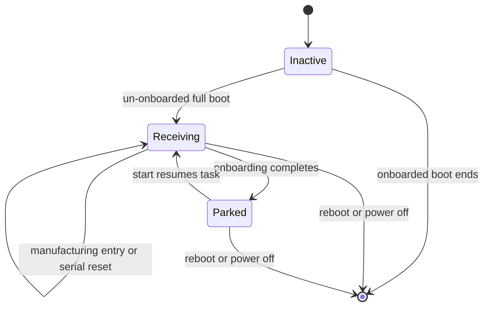

# Serial Command Service

`SerialCommandService` provides the production `#AG` command protocol over the
native USB Serial/JTAG connection. It is available automatically before
onboarding and remains available in the explicit manufacturing session. It owns
USB input, line parsing, request admission, and response formatting; the
orchestrator owns the typed operations against Go settings and factory reset.

## Files

| File | Purpose |
|---|---|
| [`serial_command.h`](../main/serial_command/serial_command.h) | Queue-copyable request/result types, transport interface, and service declaration |
| [`serial_command.cpp`](../main/serial_command/serial_command.cpp) | Parser, command task, one-in-flight state, and event/result bridge |
| [`serial_command_usb.cpp`](../main/serial_command/serial_command_usb.cpp) | USB Serial/JTAG driver, VFS routing, RX, and atomic VFS response writes |
| [`go_orchestrator.cpp`](../main/go_orchestrator.cpp) | Settings, board serial, and factory-reset command completion |
| [`ago_serial_command.py`](../../../scripts/ago_serial_command.py) | Host CLI that sends one command and filters interleaved USB logs |

## Dependencies

| Dependency | Source | Usage |
|---|---|---|
| `RTOS` | `airgradient-common` (`rtos.h`) | Command task and fixed-size event/result queues |
| USB Serial/JTAG | ESP-IDF (`esp_driver_usb_serial_jtag`) | Native USB RX and the secondary-console VFS output path |
| `Orchestrator` | product (`go_orchestrator.cpp`) | Applies typed correction requests and factory reset |
| `GoSettings` | product (`go_settings.h`) | Existing validation, persistence, and correction activation path |

## Public API

| Method | Returns | Purpose |
|---|---|---|
| `SerialCommandService(event_queue, channel)` | — | Binds the central event queue and serial transport. |
| `start()` | `bool` | Initializes the transport and command task, or resumes command reception after it was stopped. |
| `stop_receiving()` | `void` | Stops new USB command reception and parks the task without tearing down USB/VFS. |
| `complete(result)` | `void` | Delivers the orchestrator result for the accepted command. |

See [`serial_command.h`](../main/serial_command/serial_command.h) for full
signatures and protocol payload types.

## Behavior

### Lifecycle

The service is constructed on the full interactive and button-wake composition
paths. `GoApp` starts it immediately after construction when
`onboarding_done == false`; onboarded boots leave it inactive. Fast measurement
and sleep cycles do not construct the service.

Entering the boot-button manufacturing session starts the service idempotently
and adds the existing ephemeral Stationary and shutdown-cleanup behavior. A
serial `FACTORY_RESET` retains active measurement corrections while clearing the
other reset state.

When onboarding changes successfully from incomplete to complete outside the
explicit manufacturing session, the orchestrator calls `stop_receiving()`. The
task finishes any already accepted command, discards bytes from the current USB
read, and then blocks indefinitely. Calling `start()` again resumes it.

On first activation, the USB channel installs the USB Serial/JTAG driver with
256-byte RX/TX rings, routes the existing VFS through that driver, and retains a
write-only `/dev/secondary` descriptor. Each response is emitted by one VFS
`write()` call. It starts with LF and ends with LF, so it terminates a partial
normal mirrored log line before emitting its `#AG` response line. The channel
is not installed on onboarded boots, never uses UART0, and is not uninstalled
when command reception is parked.

The task uses a 3072-byte stack at priority 3 and waits up to 50 ms per USB RX
read. This finite wait lets it poll the one-item result queue. A command is
marked in flight only after central-event admission succeeds; a second valid
command receives `#AG ERROR BUSY` until the prior result is emitted. A parked
task has no periodic wake-up. The USB driver retains its bounded 256-byte RX
ring, so host data sent while parked may be dropped but cannot grow memory use.

### Protocol

Messages are UTF-8 ASCII tokens terminated by LF. CRLF is accepted. Commands
begin with `#AG` followed by one ASCII space; non-prefixed input is ignored.
Responses begin with LF followed by `#AG` and end with LF. The leading LF
terminates any partial mirrored log line before the response. The receiver
buffers at most 128 bytes per line and discards an overlong line through its
next LF. Responses are bounded to 128 bytes.

| Request | Successful Response | Other Error |
|---|---|---|
| `#AG HELP` | `#AG OK COMMANDS HELP GET_SERIAL SET_SLR <PM\|TEMP\|HUM> <scale> <intercept> GET_SLR <PM\|TEMP\|HUM> FACTORY_RESET` | `INVALID_ARGUMENT` |
| `#AG GET_SERIAL` | `#AG OK SERIAL <serial>` | `INVALID_ARGUMENT` |
| `#AG SET_SLR <target> <scale> <intercept>` | `#AG OK SLR <target> <scale> <intercept>` | `INVALID_ARGUMENT`, `OPERATION_FAILED` |
| `#AG GET_SLR <target>` | `#AG OK SLR <target> <scale> <intercept>` | `INVALID_ARGUMENT`, `SLR_NOT_SET` |
| `#AG FACTORY_RESET` | `#AG OK RESET` | `INVALID_ARGUMENT`, `OPERATION_FAILED` |

`target` is exactly `PM`, `TEMP`, or `HUM`. Numeric values must fully parse to
finite `float` values. SLR responses always render scale and intercept with six
decimal places. The board serial comes unchanged from the existing Go board
serial source.

### Settings Operations

The parser carries `Pm25Correction` or `LinearCorrection` in the typed request.
The orchestrator copies its complete settings, selects the requested custom
algorithm, validates the merged candidate, and uses
`activate_settings_candidate()` for persistence and runtime activation. No
serial-specific preferences or direct NVS writes exist.

For PM, `SET_SLR` selects `CustomViaPm25Raw` and preserves `use_epa2021` when
the current PM correction is already custom; otherwise it initializes that flag
to `false`. Temperature and humidity select the linear `Custom` algorithm.

## Edge Cases / Errors

The only protocol errors are `EMPTY_COMMAND`, `INVALID_COMMAND`,
`INVALID_ARGUMENT`, `SLR_NOT_SET`, `OPERATION_FAILED`, and `BUSY`. Extra
arguments, unknown targets, invalid numbers, and arguments supplied to
argument-free commands are `INVALID_ARGUMENT`. A valid request that cannot be
queued, persisted, or completed is `OPERATION_FAILED`. A failed or short VFS
write is not retried because retrying could interleave with a log message.
