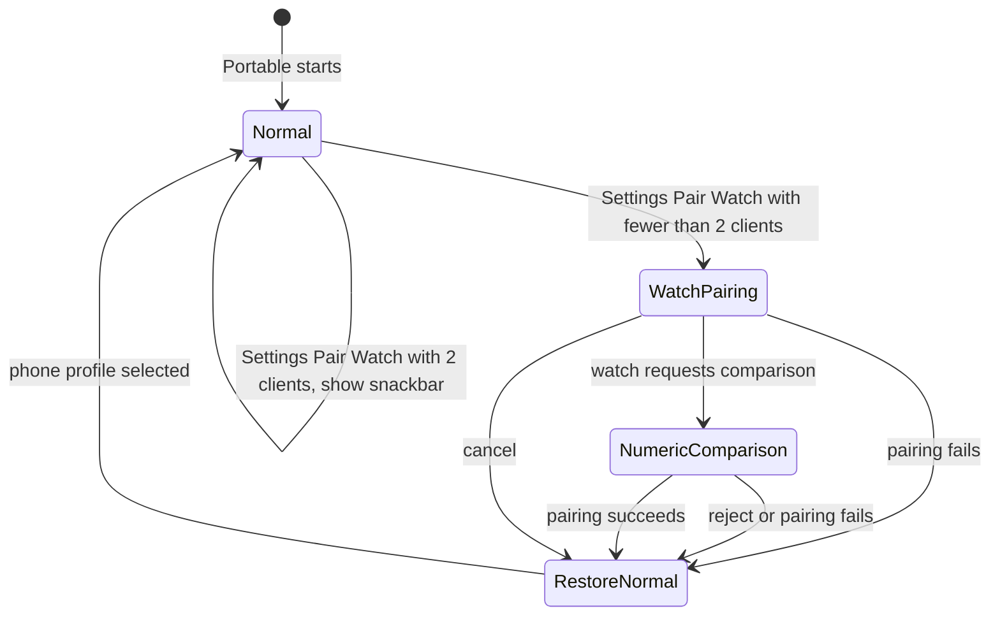

# Smartwatch Pairing

> **This is a spec.** It describes how a feature **will be built**, not what
> currently exists. Once the feature ships, the corresponding documents under
> [`../docs/`](../docs/) and [`../go_ble_client.md`](../go_ble_client.md) will
> become the source of truth and this file will typically be deleted. See
> [`docs/STYLE.md`](../../../docs/STYLE.md) → "Doc Lifecycle".

AirGradient Go will add an explicit on-device **Pair Watch** flow that permits a
watch acting as a BLE central to pair with LE Secure Connections Numeric
Comparison. Normal phone pairing will retain its current Passkey Entry journey.
Go will allow a paired phone and watch to stay connected concurrently and will
continue to broadcast the existing GATT notifications to both subscribed peers.

## Problem

Go currently uses Display Only Passkey Entry with bonding and MITM protection.
This preserves the Android app's custom six-digit PIN flow and the documented
iOS system-pairing flow, but it cannot negotiate Numeric Comparison with a
watch.

Changing the production pairing capability globally to Display Yes/No plus
Secure Connections would solve the watch case but would change fresh Android
phone pairing to the system Numeric Comparison UI. This is unacceptable.

Go also currently assumes one BLE client: it stops advertising on connection
and represents link state with one boolean. A paired phone must be able to stay
connected while a watch pairs and while either peer reconnects.

## Goals

- Add **Pair Watch** under Settings in Portable mode.
- Preserve normal-phone pairing as Display Only, Bond, and MITM.
- Pair a compatible watch using Display Yes/No, Bond, MITM, and LE Secure
  Connections (SC).
- Require an on-device Numeric Comparison accept/reject decision.
- Keep the Pair Watch page active until success, terminal failure, or explicit
  cancellation; do not impose an idle timeout.
- Permit two simultaneous BLE central connections.
- Keep advertising whenever fewer than two peers are connected.
- Treat ordinary GATT notifications and responses as broadcast data; each
  subscribed, authenticated peer may receive them.
- Preserve both legacy-phone and SC-watch bonds across disconnects and reboot.
- Keep OTA device-global and document its exclusivity for clients without
  adding a client-ownership policy.

## Non-Goals

- Do not change the mobile apps' normal fresh-phone pairing UX.
- Do not add a watch-vendor-specific BLE service, pairing filter, or identity
  classifier.
- Do not support watches that cannot act as a BLE central with authenticated SC
  Numeric Comparison.
- Do not route normal GATT notifications or command responses to their
  initiating client only.
- Do not add client count or OTA state to the Status characteristic for this
  feature.
- Do not let a watch perform BLE OTA.

## Design

### Pairing Profiles

Go will select one global NimBLE pairing profile at a time. The profile affects
future SMP pairing procedures; it must not rebuild the GATT server or disconnect
existing peers.

| Context | IO Capability | Authentication Flags | Intended Peer |
|---|---|---|---|
| Normal Portable operation | Display Only | Bond, MITM | Phone |
| Pair Watch page active | Display Yes/No | Bond, MITM, SC | SC Numeric Comparison watch |

The existing NimBLE driver writes these values to the global NimBLE security
configuration without tearing down GATT. The BLE HAL contract will explicitly
allow this runtime change: it will affect future SMP pairing procedures without
disconnecting established peers.

### Feasibility Validation

A hardware prototype has validated the pairing and connection model that this
feature will use:

- A laptop paired in Normal state using the existing PIN pairing model.
- The pairing profile changed to the watch profile while the laptop remained
  connected.
- A second central paired with Numeric Comparison while the laptop remained
  connected.

Production HIL testing will repeat these checks with the final Settings flow,
on-device comparison UI, and connection-capacity configuration.

Entering the Pair Watch page will switch to the watch profile. Cancelling,
successful pairing, or a terminal pairing failure will restore the normal phone
profile. A watch that has already paired will retain its SC bond; returning to
the normal profile will not delete or downgrade stored bonds.

### Pair Watch User Interface

Settings will contain a **Pair Watch** row in every operating mode. In Portable
mode, selecting it while fewer than two clients are connected will open a
dedicated page and activate the watch profile immediately. Outside Portable
mode, selecting it will remain in Settings and show the snackbar **"Use Portable
mode"**. The page will remain visible until the user cancels or pairing reaches
a terminal outcome.

If two clients are already connected, Go will leave the normal profile active,
remain in Settings, and show the snackbar **"2 clients already connected"**.

```text
+------------------------------+
| Pair Watch                   |
|                              |
| Open Watch app               |
| and select this              |
| AirGradient Go.              |
|                              |
| Waiting for watch            |
|                              |
|             [ Cancel ]       |
+------------------------------+
```

When the watch requests Numeric Comparison, the page will replace the waiting
prompt with the comparison value. The user must confirm only when the watch
shows the same value. Confirm is selected by default. Cancel will reject the
pending comparison and return to normal pairing configuration.

```text
+------------------------------+
| Pair Watch                   |
|                              |
| Does this match              |
| your watch code?             |
|                              |
|           123 456            |
|                              |
| [ Cancel ]       [ Confirm ] |
+------------------------------+
```

On success, Go will show a brief paired result, restore the normal profile, and
return to Settings. A terminal pairing failure will show an error, restore the
normal profile, and return to Settings. The user can enter Pair Watch again to
retry.

### Pairing and Connection State



In Normal state, an unbonded phone will receive the existing PIN pairing model.
While the explicit WatchPairing page is active, an unbonded phone is allowed to
reach the temporary Numeric Comparison profile. BLE does not provide a
vendor-neutral way to distinguish that phone from an unknown watch before
pairing, and this temporary behavior is acceptable because the user explicitly
entered Pair Watch.

The numeric-comparison callback will carry the connection handle and displayed
number to the product layer. The Pair Watch page will explicitly inject an
accept or reject response after the user acts. It must never inherit NimBLE's
default automatic acceptance behavior. The feature will not reserve a connection
slot, classify clients, or impose an additional pairing-candidate policy.

### Two Connections and Advertising

Portable Go will be configured for two peripheral connections. Connection state
will be a count rather than a single-client boolean:

```text
is_connected = connected_client_count > 0
```

The first connection will not stop advertising. After every connect or
disconnect callback, Go will start advertising again when the count is below
two. A full connection set will not advertise until a peer leaves.

The connected icon will mean that at least one peer has an authenticated link.
GATT read/write authorization remains per connection through NimBLE's existing
authenticated characteristic properties. A normal notification continues to be
sent to every subscribed, secured peer; it is valid for a phone to receive a
watch-triggered response and vice versa.

### Bonding and Reconnection

Normal phone bonds may use legacy Passkey Entry. Watch bonds will use
authenticated SC Numeric Comparison. Both bond types will persist in NimBLE NVS
and reconnect with their established keys without new pairing after a profile
restoration or reboot.

Factory reset will continue to delete all stored BLE bonds. The implementation
will size NimBLE's bond and CCCD capacity for the supported two-peer use case.

### GATT, History, and OTA Coexistence

This feature adds no GATT services, characteristic UUIDs, or payload fields.
The existing authenticated Go, provisioning, OTA, and Device Information
services remain available to both peers.

History and configuration responses remain broadcast as part of the existing
global protocol model. Clients must tolerate receiving a response initiated by
another connected peer.

OTA is device-global and exclusive. The client contract in
[`../go_ble_client.md`](../go_ble_client.md) will state that an OTA-capable
client must subscribe to OTA Status. While an OTA transfer is active, clients
other than the initiating client must not send OTA Control or Data. Smartwatch
clients must not use the OTA service.
This does not require a client count field, a Status payload change, or general
client ownership.

## Implementation Plan

1. Set Portable NimBLE maximum connections to two. Retain advertising while a
   slot is available, and reject a Pair Watch Settings request with the
   "2 clients already connected" snackbar when both slots are occupied.
2. Replace the single connection boolean and single-handle authentication query
   with count-based connection state and an any-authenticated-peer query.
3. Amend the BLE HAL `set_security()` contract for runtime profile switching and
   extend the HAL/driver Numeric Comparison bridge so product UI can receive the
   comparison value and explicitly accept or reject it.
4. Add the Settings row, Pair Watch page, pairing-result/error states, and
   orchestrator state transitions. Keep the pairing profile non-persistent and
   restore the normal profile on every page exit path.
5. Extend the Go BLE client contract with the two-peer discovery/pairing rules
   and the OTA exclusivity note.
6. Update the shipped BLE, orchestrator, UI, architecture, and product
   documentation after implementation. Delete this spec when those documents
   describe the released behavior.

## Testing Strategy

### Host Tests

- Verify profile selection for normal, Pair Watch entry, success, failure, and
  cancellation.
- Verify connection count transitions and advertising decisions for `0 → 1`,
  `1 → 2`, `2 → 1`, and `1 → 0`.
- Verify only an explicit UI result accepts or rejects a pending Numeric
  Comparison.
- Verify the connected/authenticated UI state when one of two peers disconnects.

### Hardware-In-The-Loop Tests

- Fresh Android phone pairing in Normal state invokes the existing app-owned
  PIN UI.
- A bonded phone remains connected and can use authenticated GATT while Pair
  Watch activates and restores its profile.
- A compatible watch completes Numeric Comparison only after matching numbers
  are confirmed on the watch and Go.
- Go-side rejection, watch-side rejection, and cancellation leave no usable
  new bond and restore the normal profile.
- Phone and watch both subscribe to notifications and access protected GATT
  concurrently.
- Disconnecting either peer below capacity resumes discoverability for the open
  connection slot.
- Legacy phone and SC-watch bonds reconnect after reboot without re-pairing.
- Selecting Pair Watch with two connected clients leaves the normal profile
  active and shows the full-capacity snackbar.

## Open Questions

- Measure the production NimBLE memory budget, required CCCD entries, and bond
  capacity after the two-connection implementation is complete.
- Finalize the exact Settings-row wording and translated text for the Pair Watch
  waiting, comparison, success, and failure pages.
